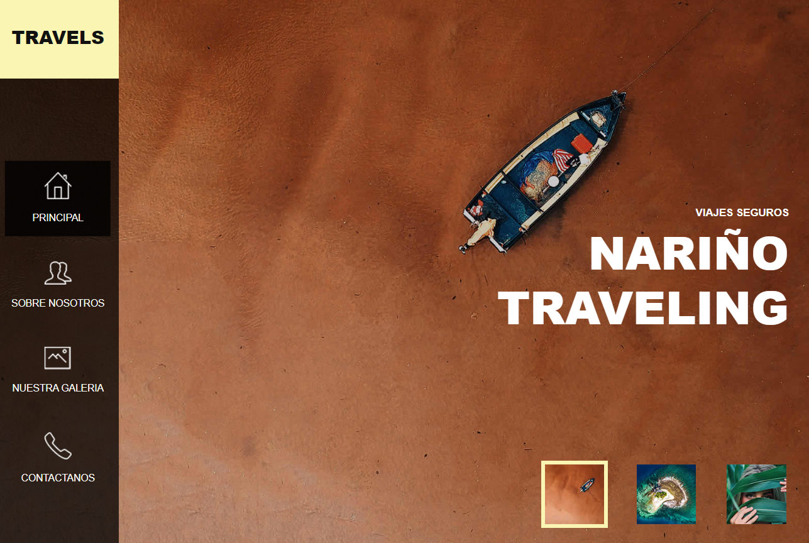

# Pagina_web / Nariño Traveling ✈️

# Proyecto Nariño Traveling

Sitio web turístico estático de Nariño — HTML5, CSS3 y JavaScript con Bootstrap 4, jQuery, Owl Carousel y Font Awesome. Diseño responsive con 4 secciones, desplegado en Vercel

## Empezando

Para probar la pagina web entra al link " https://narino-traveling.vercel.app/ " y asi tienes acceso a la informacion de nuestra pagina web.

### Requisitos previos

Tener conexcion a internet
Tener dispositivo electronico (Celular,computador o tablet) y contar con un buen navegador web para una buena ejecucion del codigo.

## Ejecutando las pruebas

Para el ejecutamiento del codigo HTML se debe ingresar al link de la pagina web para poder interactuar con el.

## Despliegue (Deployment)

Este codigo al ser desarrollado en HTML y JavaScript sirve para hacer la parte del frontend en este sitio de viajes el cual va facilitar a los usuarios la interaccion con la pagina.

## Construido con

HTML: lenguaje de marcado para la elaboracion de paginas web.
JavaScript: Lenguaje empleado para elaboracion de la pagina web.

## Versionado

Recomendamos utilizar la version de windows 7 a 11 y tener la ultima version de Google Chrome.
## Autores

* **Julian Andres Ceballos, Santiago Luna y Nicolas Maya** 

## Expresiones de gratitud (Acknowledgments)

* Muchas gracias por utilizar este codigo de HTML desarrollado para un sitio web de viajes.
* Agardecemos a nuestro profesor Gustavo Willyn Sánchez Rodriguez por sus enseñanzas.
